# AI_Investment_Lab — 美股投研自动化流水线

## 一句话
基于 Python 的美股投研流水线，整合行情下载、新闻舆情、基本面数据与量化分析，输出结构化 metrics 与人性化研报。

## 快速上手

```bash
# 克隆
git clone https://github.com/dennisgukaidi/AI_Investment_Lab.git
cd AI_Investment_Lab

# 创建并激活虚拟环境（Windows）
python -m venv .venv
.venv\Scripts\activate

# 安装依赖（核心）
pip install ib_insync pandas numpy yfinance textblob

# 可选依赖（按需安装）
pip install fredapi       # 宏观数据收集
pip install pytrends      # 替代数据（Google Trends）

# 初始化数据库
python scripts/init_db.py --init
```

## 核心工作流

```mermaid
flowchart LR
    A[portfolio_pipeline] -->|data/raw/*.csv| B[news_collector]
    B -->|data/news/*.json| C[fundamental_data_collector]
    C -->|data/fundamentals/*.json| D[macroeconomic_data_collector]
    D -->|data/macroeconomic/*.json| E[analyze_report]
    E -->|data/analysis/*_metrics.json| F[import_analysis_to_db]
    F -->|investment_lab.db| G[strategy_advisor / run_pipeline]
    G -->|reports/*.md| H[🟢 策略报告]
```



### 完整更新流程（7 步）

```bash
# 1. 行情下载（TWS → yfinance fallback）
python scripts/portfolio_pipeline.py

# 2. 新闻更新 + 情绪打分
python scripts/news_collector.py

# 3. 基本面数据收集（P/E, P/B, P/S, 财务健康等）
python scripts/fundamental_data_collector.py <TICKER>
# 循环执行：for %t in (AAPL GOOG AMZN TSLA) do python scripts/fundamental_data_collector.py %t

# 4. 宏观经济数据更新（内置 FRED API key，直接运行）
python scripts/macroeconomic_data_collector.py

# 5. 量化分析计算
python scripts/analyze_report.py --all

# 6. 批量导入数据库（quantitative + fundamentals + sentiment + macro）
python scripts/import_analysis_to_db.py

# 7. 生成策略报告
python scripts/run_pipeline_and_reports.py --skip-pipeline --skip-news --summary
```

### 一键流程（简化版，不生成新 metrics）

```bash
python scripts/run_pipeline_and_reports.py --summary
```

### 单只股票分析（含自动入库）

```bash
python scripts/analyze_report.py <TICKER>
```

## 目录结构

```
AI_Investment_Lab/
├── data/
│   ├── raw/                    # 历史行情 CSV
│   │   └── {TICKER}_180d.csv   # OHLCV + IV + 分析师数据
│   ├── news/                    # 新闻与情绪
│   │   └── {TICKER}_news.json   # 标题/摘要/发布时间/sentiment_polarity
│   ├── fundamentals/            # 基本面估值数据
│   │   └── {TICKER}_fundamentals.json
│   ├── analysis/                # 量化分析结果
│   │   └── {TICKER}_metrics.json  # Bootstrap/IV分位/Monte Carlo/风险矩阵
│   ├── alternative/             # 替代数据（需 pytrends）
│   ├── macroeconomic/           # 宏观数据（需 FRED key）
│   ├── holdings/                # 持仓快照（TWS 同步）
│   └── watchlist.csv            # 观察清单（逗号分隔）
│
├── scripts/
│   ├── portfolio_pipeline.py          # ⭐核心 持仓同步 + 行情下载 + 数据补全
│   ├── news_collector.py              # ⭐核心 新闻抓取 + TextBlob 情绪分析
│   ├── fundamental_data_collector.py  # ⭐核心 基本面数据收集
│   ├── macroeconomic_data_collector.py# ⭐核心 宏观经济数据（内置 FRED key）
│   ├── analyze_report.py              # ⭐核心 量化分析引擎（MC/Bootstrap/技术面）
│   ├── _db_ingest_helper.py           # ⭐核心 数据库入库助手
│   ├── import_analysis_to_db.py       # ⭐核心 批量导入 metrics 到 SQLite
│   ├── strategy_advisor.py            # ⭐核心 策略顾问报告生成
│   ├── run_full_pipeline.py    # 辅助 一键流数据收集
│   ├── init_db.py                     # 辅助 数据库初始化/清理
│   └── alternative_data_collector.py  # ⭐核心 Google Trends
│
├── reports/                     # 生成的策略报告/日志
│   └── strategy_{TICKER}_{YYYYMMDD}.md
│
├── investment_lab.db            # SQLite 数据库
├── rules.md                     # AI 可执行操作手册（触发词→步骤）
└── README.md                    # 本文件
```

## 数据库（investment_lab.db）

| 表名 | 主键 | 存储内容 |
|------|------|---------|
| `quantitative` | `id` (自增) | 量化分析指标 JSON（Monte Carlo、Bootstrap、IV 分位、风险矩阵等） |
| `fundamentals` | `(ticker, date)` | 基本面数据 JSON（P/E、P/B、P/S、财务健康、增长指标） |
| `sentiment` | `(ticker, date)` | 舆情得分（新闻平均极性，-1 ~ 1） |
| `macro` | `date` | 宏观数据 JSON（利率、CPI、非农就业等） |

### 重要说明
- `analyze_report.py --all` 模式**不会自动触发入库**，需手动运行 `import_analysis_to_db.py`
- `analyze_report.py <TICKER>`（单只模式）会自动触发 `_db_ingest_helper.ingest_all()` 完成全表入库
- DB 文件 `.gitignore` 已忽略，不会提交到仓库

## 策略报告内容

`strategy_advisor.py` 生成的 Markdown 报告包含：
1. **价格与动能**：当前价、MA20/60/200 趋势、RSI-14
2. **回本概率（10/20/60d）**：Bootstrap 方法+结构止损触达概率
3. **风险对冲位**：1.5×ATR 止损、激进目标价、RR 评分
4. **估值与安全性**：IV 分位、拥挤度（IV Rank + RSI 双指标）
5. **宏观情绪**：SPY 趋势、超额收益、收益相关性
6. **持仓相关性校验**：与已有持仓的 R² 相关系数
7. **止损与凯利仓位**：建议止损位 + 简化凯利公式最大权重

## 故障排查

| 问题 | 检查 |
|------|------|
| TWS 连接失败 | 确保 TWS/IB Gateway 运行，端口 7496 已启用 API |
| `pip install` 失败 | 检查 Python 版本 ≥ 3.8，在 `.venv` 中操作 |
| `yfinance` 数据为空 | 股票代码可能已退市/改名，或超出 yfinance 覆盖范围 |
| `fundamentals` 表无更新 | 需运行 `fundamental_data_collector.py` + `_db_ingest_helper` 批量入库 |
| 报告缺少内容 | 检查 `investment_lab.db` 中 `quantitative` 表是否有最新 metrics |
| 日期不对 | 脚本内可能还在使用旧的日期后缀模式，检查 `strategy_advisor` 的自动日期命名 |

## 注意事项
- 所有脚本执行前需激活虚拟环境：`.venv\Scripts\activate`
- 禁止直接手动编辑持仓数据（由 `portfolio_pipeline.py` 通过 TWS 自动维护）
- 如需实盘交易操作，AI 必须先向用户确认并获得明确许可
- `.gitignore` 已排除所有运行产物（data/ 子目录、reports/、*.db），仅仓库保留代码+配置

## 替代数据 API

`alternative_data_collector.py` 包含 2 个数据源：

| 数据源 | 是否需要 API Key | 获取方式 |
|--------|-----------------|---------|
| **Google Trends** | ❌ 无需 key | `pip install pytrends` 后直接使用，无需注册 |
| **Reddit 情绪** | ✅ 免费注册（占位） | https://www.reddit.com/prefs/apps → 创建应用获取 `client_id` 和 `client_secret`；使用 `pip install praw` 集成 |

> Google Trends 可直接使用；Reddit 部分当前为占位返回 0 分，如需启用需实现 PRAW API 集成。

## 依赖

**核心依赖（必须安装）：**
```
ib_insync pandas numpy yfinance textblob
```

**可选依赖（按需）：**
```
fredapi          # 宏观经济数据收集器（内置 FRED API key，无需额外配置）
pytrends         # 替代数据收集器（Google Trends，无需 API key）
```

## 最后更新
2026-05-20
